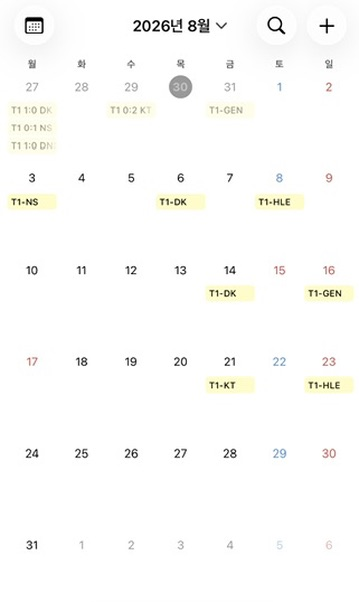

# T1 LoL Esports 캘린더

T1 1군 경기(LCK, MSI, Worlds, EWC, First Stand, KeSPA Cup)만 모은 구독형 ICS 캘린더.



## 설치 / 실행

```bash
npm install
npm run build
npm run generate   # public/t1.ics 생성/갱신
```

- `npm run dev` : 컴파일 없이 바로 실행
- `npm run typecheck` : 타입 검사만

## 자동 갱신

`.github/workflows/update.yml`이 3시간마다 자동 실행되어 `public/t1.ics`를 갱신하고
GitHub Pages(Settings → Pages → Source: GitHub Actions)에 배포한다. Actions 탭에서
`Run workflow`로 수동 실행도 가능.

## 설정 파일

- `src/config/competitions.ts` — 수집 대상 대회(leagueId) 추가/삭제
- `src/config/filter.ts` — T1 판별 기준(`TARGET_TEAM_CODE`) / 2군·아카데미 제외 규칙
- `src/config/teamNames.ts` — 팀 코드 -> 표시 이름 매핑 (스폰서명 바뀌면 여기만 수정)
- `src/config/retention.ts` — 종료 경기 보관 기간(기본 7일)

## 참고

데이터 소스는 요구사항의 `lol-events` 대신 Riot 공식 LoL Esports API
(`esports-api.lolesports.com`)를 쓴다 — lol-events는 EWC/First Stand 피드가 없고
스코어 정보도 없어서. 경기 장소/패치 버전은 이 API가 제공하지 않아 DESCRIPTION에서 생략.
